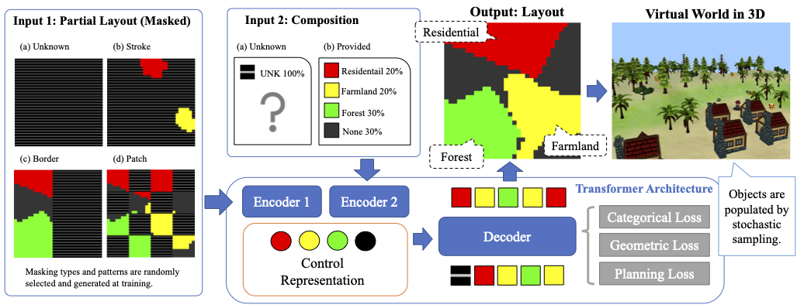

# Learning Layout Generation for Virtual Worlds

## Overview
A transformer-based model that generates world land-use layouts given user controls. <br/>
Land-use refers to the way humans utilize and manage land, e.g., residential, farmland, and forest.
### Read [[Paper](https://link.springer.com/content/pdf/10.1007/s41095-023-0365-1.pdf)]




## Setup Environment
Step 1: Create a python environment using Anaconda or Miniconda:
```
conda create -n lutf python=3.10
conda activate lutf
```
Step 2: Install packages:
```
pip install -r requirements.txt
```


## Training & Inference
Run training:
```
python train.py --config configs/lutf.json
```
Run inference:
```
bash generate.sh
```


## Evaluation Data
Download the evaluation [data](https://drive.google.com/drive/folders/1pVOFyX_uKU-jNa3pY5MQJ0lvoS7PcaAy?view?usp=sharing) and put the .pkl files under ```data/evaluate/```.
#### Data Value Mapping
| Land-use | Value | Remark |
|----------|-------|--------|
| Mask | 0 | To be generate by models |
| None | 1 | Not identified land |
| "Residential" | 2 | - |
| "Farmland" | 3 | - |
| "Industrial" | 4 | - |
| "Meadow" | 5 | - |
| "Grass" | 6 | - |
| "Retail" | 7 | - |
| "Recreation Ground" | 8 | - |
| "Forest" | 9 | - |
| "Commercial" | 10 | - | 
| "Railway" | 11 | - |
| "Cemetery" | 12 | - |


##  Citation
```
@article{cheng2024learning,
  title={Learning layout generation for virtual worlds},
  author={Cheng, Weihao and Shan, Ying},
  journal={Computational Visual Media},
  year={2024},
  publisher={Springer}
}
``` 